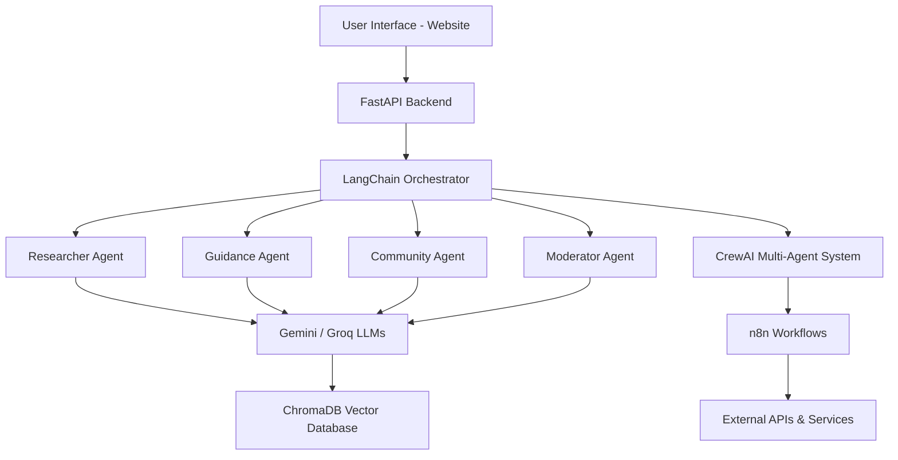

# 🌸 BabyNest AI Chatbot

An AI-powered conversational assistant that supports expecting and new mothers with **reliable health guidance, empathetic coaching, and community connection**.  

Built with **FastAPI, LangChain, CrewAI, ChromaDB, and n8n**, BabyNest delivers **multi-agent reasoning**, **retrieval-augmented generation (RAG)**, and **workflow automation**.

---

## 🚀 Features

- **FastAPI Backend** — secure and scalable REST API.  
- **LangChain Orchestration** — retrieval + generation chains with memory.  
- **CrewAI Agents**:
  - **Maternal Health Researcher** → retrieves accurate medical information.  
  - **Personalized Guidance Coach** → empathetic, stage-specific advice.  
  - **Community & Testimonials Agent** → relatable peer stories.  
  - **Moderator Agent** → ensures safety & factual content.  
- **ChromaDB** — vector database for semantic document retrieval.  
- **LLMs** — integrates **Google Gemini** and **Groq** with routing/fallback.  
- **n8n Workflows** — automated email notifications, ingestion triggers, and escalation pipelines.  

---

## 🏗️ System Architecture



---

## 📂 Project Structure

```
chatbot/
 ├── README.md              # Project documentation
 ├── requirements.txt       # Python dependencies
 ├── pyproject.toml         # Poetry / build config
 ├── Dockerfile             # Containerization
 ├── .env                   # API keys & secrets
 ├── knowledge/             # Brand guidelines & domain docs
 ├── db/                    # ChromaDB vector store
 └── src/babynest/
      ├── app.py            # FastAPI app entry point
      ├── crew.py           # CrewAI agent orchestration
      ├── components.py     # RAG tools, conversation memory
      ├── db_handler.py     # Knowledge ingestion & embeddings
      ├── chat_models.py    # Pydantic request/response schemas
      └── config/
           ├── agents.yaml  # Agent definitions
           └── tasks.yaml   # Task workflows
```

---

## 🔑 Prerequisites

- **Python 3.10+**
- **Pip / Virtualenv**
- API Keys:
  - `GOOGLE_API_KEY`
  - `GROQ_API_KEY`

---

## ⚙️ Setup

```bash
# Clone repository
git clone <repo-url>
cd chatbot

# Create virtual environment
python -m venv .venv
source .venv/bin/activate   # (Linux/Mac)
.venv\Scripts\activate      # (Windows)

# Install dependencies
pip install -r requirements.txt

# Configure environment variables
cp .env.example .env
# add GOOGLE_API_KEY=... and GROQ_API_KEY=...
```

---

## ▶️ Running Locally

From project root:
```bash
PYTHONPATH=src uvicorn babynest.app:app --reload
```

Server will be available at:
```
http://127.0.0.1:8000
```

---

## 📡 API Endpoints

### `POST /chat`
Send a user message.  

**Request**
```json
{
  "session_id": "abc123",
  "message": "What are signs of postpartum depression?"
}
```

**Response**
```json
{
  "reply": "Common signs include mood swings, persistent sadness..."
}
```

---

### `POST /session/end`
End a session.  

**Request**
```json
{"session_id": "abc123"}
```

**Response**
```json
{"status": "session ended"}
```

---

### `GET /health`
Health check.  
```json
{"status": "ok"}
```

---

## 🧪 Testing

```bash
pytest
```

Tests include:
- **Unit tests** for FastAPI endpoints.  
- **Integration tests** for LangChain + ChromaDB.  
- **Agent collaboration simulations**.  
- **Safety tests** for hallucination and unsafe outputs.  

---

## 📈 Success Metrics

- **85%+** user satisfaction  
- **75%+** autonomous resolution rate  
- **<2s** average latency  
- **99.9%** uptime  
- Scales to **10k concurrent sessions**  

---

## 🌐 Deployment

1. Build Docker image:
   ```bash
   docker build -t babynest .
   ```
2. Run locally:
   ```bash
   docker run -p 8000:8000 babynest
   ```
3. Deploy to **Google Cloud Run** (or similar serverless infra).  

CI/CD pipeline ensures:
- Code quality checks  
- Automated tests  
- Safe deployment  

---

## 📬 Workflow Automation with n8n

- **Email Notifications** → reminders, curated guides.  
- **Community Engagement** → notifications for new discussions/testimonials.  
- **Knowledge Base Updates** → auto-ingest new medical docs.  
- **Task Automation** → e.g., weekly pregnancy tips emails.  

---

## 🛡️ Safety & Compliance

- Moderator Agent filters misinformation or unsafe content.  
- Crisis phrases trigger redirection to **human resources / hotlines**.  
- All data handled under health data privacy and ethical AI standards.  

---

## 📅 Roadmap

- ✅ MVP multi-agent chatbot  
- 🌐 Multi-language support  
- 🤝 Expanded community features  
- 📱 Mobile app integration  
- 🧠 Personalized long-term user memory  

---

## 👥 Authors

- **Eric** — Backend, FastAPI, LangChain, Chroma integration  
- **Merlyn** — Ingestion, Embeddings, n8n workflows  
- **Joint** — CrewAI multi-agent system, testing, documentation  


# Babynest Crew

Welcome to the Babynest Crew project, powered by [crewAI](https://crewai.com). This template is designed to help you set up a multi-agent AI system with ease, leveraging the powerful and flexible framework provided by crewAI. Our goal is to enable your agents to collaborate effectively on complex tasks, maximizing their collective intelligence and capabilities.

## Installation

Ensure you have Python >=3.10 <3.14 installed on your system. This project uses [UV](https://docs.astral.sh/uv/) for dependency management and package handling, offering a seamless setup and execution experience.

First, if you haven't already, install uv:

```bash
pip install uv
```

Next, navigate to your project directory and install the dependencies:

(Optional) Lock the dependencies and install them by using the CLI command:
```bash
crewai install
```
### Customizing

**Add your `OPENAI_API_KEY` into the `.env` file**

- Modify `src/babynest/config/agents.yaml` to define your agents
- Modify `src/babynest/config/tasks.yaml` to define your tasks
- Modify `src/babynest/crew.py` to add your own logic, tools and specific args
- Modify `src/babynest/main.py` to add custom inputs for your agents and tasks

## Running the Project

To kickstart your crew of AI agents and begin task execution, run this from the root folder of your project:

```bash
$ crewai run
```

This command initializes the babynest Crew, assembling the agents and assigning them tasks as defined in your configuration.

This example, unmodified, will run the create a `report.md` file with the output of a research on LLMs in the root folder.

## Understanding Your Crew

The babynest Crew is composed of multiple AI agents, each with unique roles, goals, and tools. These agents collaborate on a series of tasks, defined in `config/tasks.yaml`, leveraging their collective skills to achieve complex objectives. The `config/agents.yaml` file outlines the capabilities and configurations of each agent in your crew.

## Support

For support, questions, or feedback regarding the Babynest Crew or crewAI.
- Visit our [documentation](https://docs.crewai.com)
- Reach out to us through our [GitHub repository](https://github.com/joaomdmoura/crewai)
- [Join our Discord](https://discord.com/invite/X4JWnZnxPb)
- [Chat with our docs](https://chatg.pt/DWjSBZn)

Let's create wonders together with the power and simplicity of crewAI.
